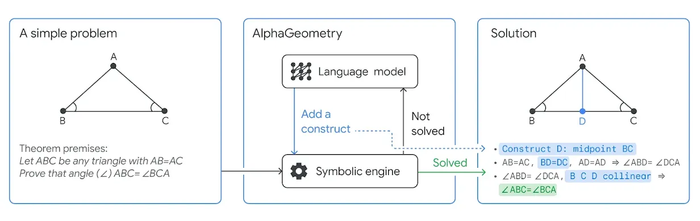

### In a nutshell
The idea behind a neurosymbolic system is straightforward but truly ingenious.
The basic architecture comprises of two subsystems - a neural network and a symbolic solver.
They represent the creative/intuitive and the logical aspect of problem solving respectively and mimics how some problem solving is generally done by humans.

### Key Ideas

_(Image from Google DeepMind's [article announcing AlphaGeometry](https://deepmind.google/discover/blog/alphageometry-an-olympiad-level-ai-system-for-geometry/))_

Given a problem, the system first tries to solve it via the symbolic solver. This is almost mechanical in nature as the problem is decomposed into symbols and a form of algebra and mathematical logic is used to arrive at a solution. 

In case the system is unable find a solution, it turns to the neural network to "imagine" various constructs (additional pieces of information, constraints or beliefs) that added to the problem. These candidate constructs are then evaluated for their effectiveness and the best one is added to the problem. The control then goes back to the symbolic solver. This back-and-forth continues until eventually, the problem is solved.

### Real World Implementations
This system has been successfully used in [AlphaGeometry](https://deepmind.google/discover/blog/alphageometry-an-olympiad-level-ai-system-for-geometry/), a system used to solve geometry problems from the International Mathematics Olmypiad (IMO), with remarkable results (system performance is approaching to that of an average IMO gold medallist). The code for this system has also been made open source and can be checked out [here](https://github.com/google-deepmind/alphageometry).

While the AlphaGeometry system has been tuned for geometry problems, that fact that it works well shows that there is indeed merit to building more systems of this nature when solving problems which may require a more precise (and deterministic) solution, but with a touch of creativity. It should be noted that AlphaGeometry was not the first neurosymbolic system (with research on various iterations of this idea going back to the 1990s), and it definitely will not be the last.
