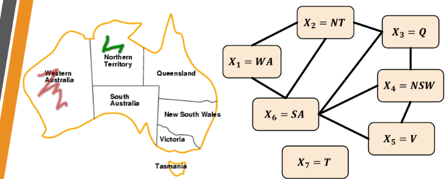

### In a nutshell

### Key Ideas

### Notes
#### Constraint Satisfaction Problems (CSPs)
**Basic Properties**
- Variables (`X = X_1, X_2, X_3, ..., X_n`) are all linear rational values
    - `X_i` belongs to domain `D_i`
- Constraints (`C`) are all linear
    - Constraints list which variables are involved and how
- Effective solvers reduce search space significantly and quickly w/ use of variable dependencies
- Objective: Find a legal assignment of values (`y = y_1, y_2, y_3, ..., y_n`) to variables such that all constraints are satisfied
    - **Complete**: All variables are set
    - **Consistent**: No constraint is violated
- States are partial assignments of the variables
- Can be encoded as a **Constraint Graph** where Nodes are variables, Edges are constraints

**An example**
Variables: `X = {WA, NT, Q, NSW, V, SA, T}`
Domains: `D_i = {R, G, B}`
Constraints: If `(X_i, X_j)` in edges (`E`), then `color(X_i) =/= color(X_j)`

*Graph coloring of the territories in Australia, with no adjacent territory sharing the same color*

**Variations**
- Variable type
    - Discrete
        - Generally considered computationally intractable problems
    - Continuous
        - Generally considered easier
        - linear programming problems are solvable in polynomial time
- Domain type
    - Finite Domains: e.g. 8-queens
    - Infinite Domains: e.g. Job-Shop Scheduling
- Constraint type
    - Unary: One variable e.g. SA =/= G
    - Binary: Two variables e.g. SA =/= WA
    - Global (higher order): 3 or more variables e.g. X_1 + X_2 - 4*X_7 <= 15

#### Backtracking Search for CPS

#### Local Consistency

#### Local Search

#### Misc

#### Needs Exploration

### Resources
